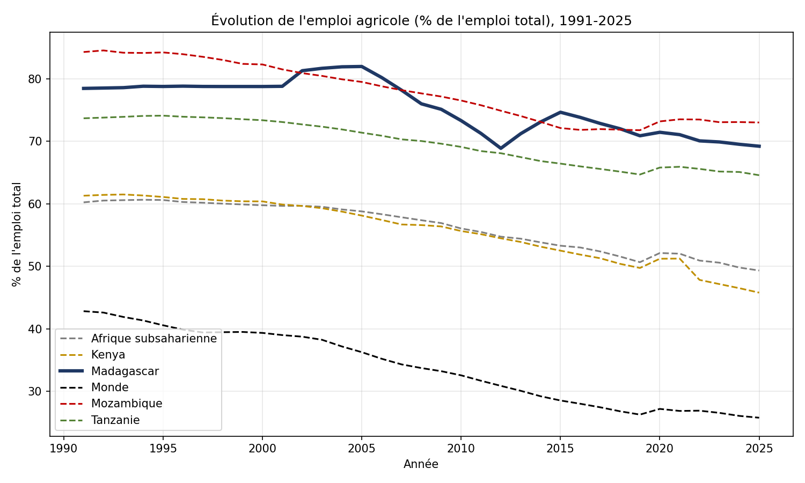
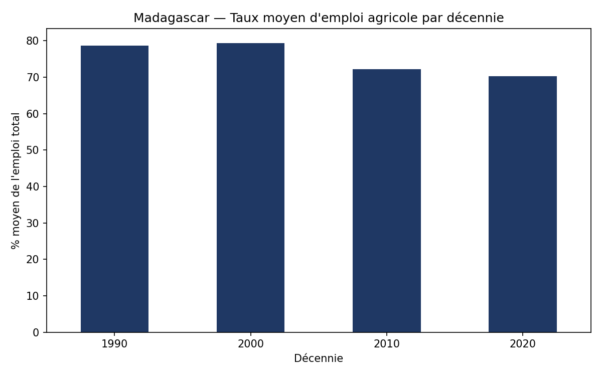

# Évolution de l'emploi agricole à Madagascar (1991-2025)

## Description

Ce projet analyse l'évolution du taux d'emploi agricole à Madagascar entre 1991 et 2025,
et le compare à celui de pays voisins (Kenya, Tanzanie, Mozambique) ainsi qu'aux moyennes
régionale (Afrique subsaharienne) et mondiale.

L'objectif est d'illustrer, à partir de données officielles, la trajectoire de transition
structurelle de l'économie malgache par rapport à ses pairs.

## Données

Source : [Banque Mondiale — World Development Indicators](https://data.worldbank.org/indicator/SL.AGR.EMPL.ZS)
Indicateur : `SL.AGR.EMPL.ZS` — Emploi dans l'agriculture (% de l'emploi total), estimation modélisée OIT.

Le fichier brut se trouve dans `data/raw/`, la version nettoyée dans `data/processed/`.

## Méthodologie

1. **Nettoyage** (`scripts/clean_data.py`) : transformation du fichier Excel de la Banque Mondiale
   (format large, une colonne par année) en un tableau long, filtré sur les pays/régions étudiés.
2. **Analyse** (`scripts/analyze.py`) : calcul de la variation sur la période, comparaison entre pays,
   moyenne par décennie pour Madagascar.
3. **Visualisation** : deux graphiques générés avec Matplotlib.

## Résultats



- Madagascar est passé de **78,5 % en 1991** à **69,2 % en 2025** (-9,2 points en 34 ans).
- En 2025, Madagascar reste au-dessus de la moyenne subsaharienne (49,3 %) et très au-dessus
  de la moyenne mondiale (25,8 %) : l'économie reste fortement dépendante de l'agriculture.
- Le Mozambique est le seul pays du groupe encore plus agricole que Madagascar en 2025.



## Outils utilisés

Python, Pandas, Matplotlib

## Comment reproduire

```bash
pip install -r requirements.txt
python scripts/clean_data.py
python scripts/analyze.py
```

## Auteur

Jules Adrien MAMAHY — Master Économie-Gestion, Université de Fianarantsoa
[LinkedIn](https://linkedin.com/in/julesadrien.mamahy)
